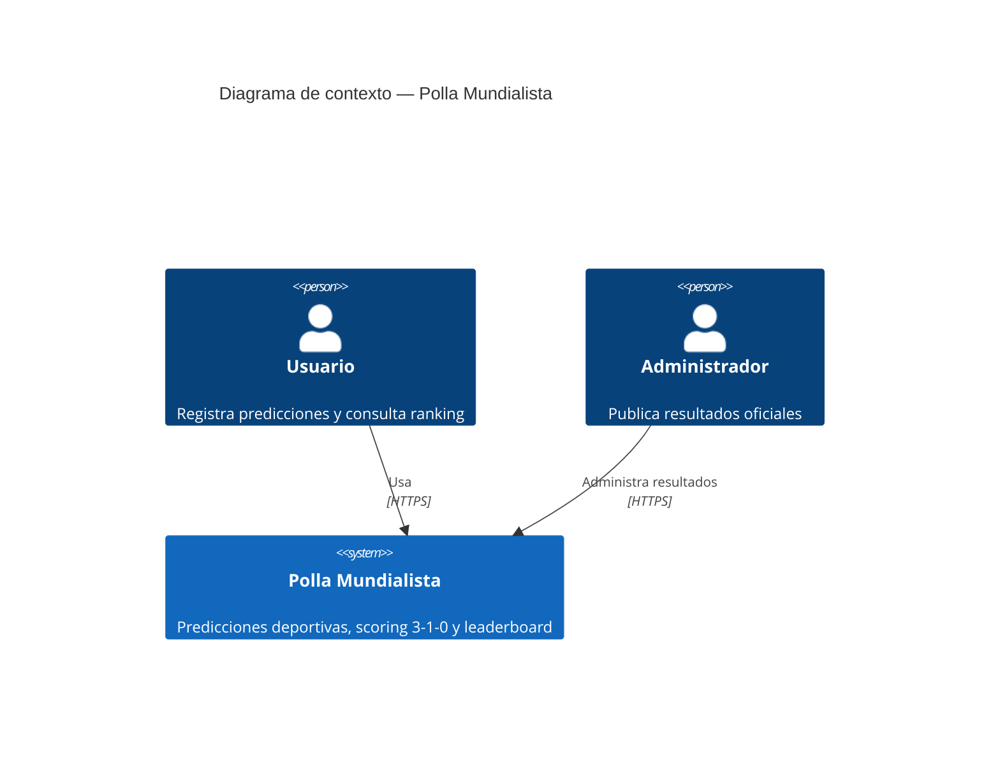
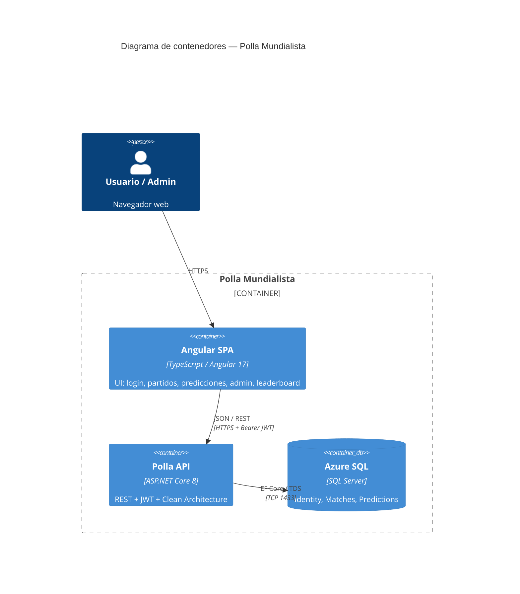
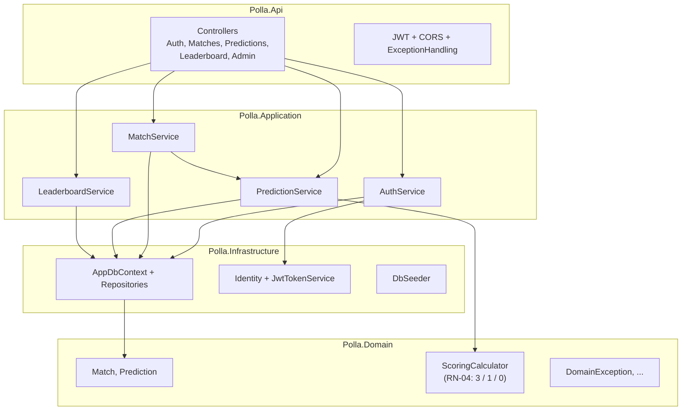
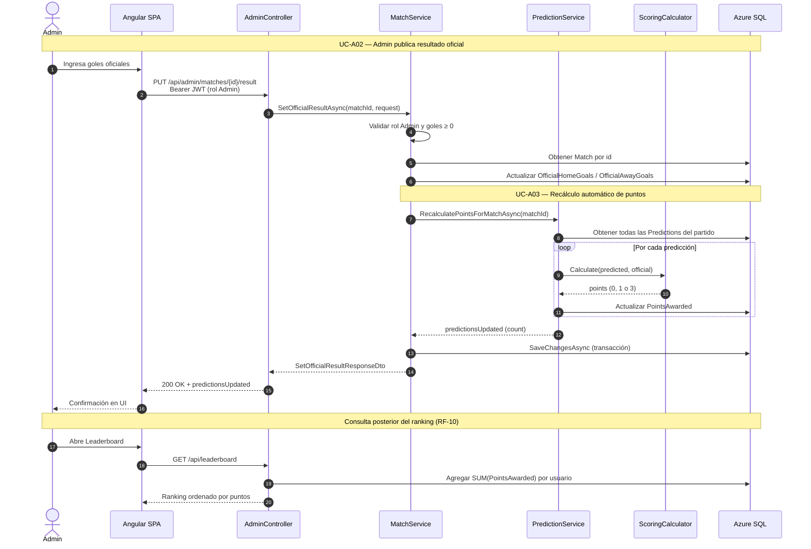

# Arquitectura — Polla Mundialista

Documento de arquitectura del MVP (Tarea 040): diagrama C4 de contenedores, capas backend y secuencia de scoring.

---

## 1. Contexto del sistema (C4 — Nivel 1)



---

## 2. Contenedores (C4 — Nivel 2)

Despliegue actual del MVP:

| Contenedor | Tecnología | Hosting |
|------------|------------|---------|
| Angular SPA | Angular 17 standalone | **Azure Static Web Apps** |
| Polla API | ASP.NET Core 8 | **Render** (Docker) |
| Base de datos | Azure SQL (SQL Server) | **Azure** |



### Comunicación entre contenedores

| Origen | Destino | Protocolo | Notas |
|--------|---------|-----------|-------|
| Navegador | Angular SPA | HTTPS | Rutas SPA; fallback en `staticwebapp.config.json` |
| Angular SPA | Polla API | HTTPS + JWT | `environment.prod.ts` → `https://pollabizagi.onrender.com` |
| Polla API | Azure SQL | ADO.NET / EF Core | Connection string vía variable de entorno en Render |
| CORS | Solo origen SWA | — | `Cors__AllowedOrigins__0` en Render (Tarea 038) |

---

## 3. Componentes backend (C4 — Nivel 3)

Clean Architecture con dependencias hacia el dominio:



### Servicios Application y responsabilidades

| Servicio | RF / UC | Responsabilidad |
|----------|---------|-----------------|
| `AuthService` | RF-01, RF-02 | Registro, login, emisión JWT |
| `MatchService` | RF-04, RF-09 / UC-A02 | Listar partidos; publicar resultado oficial (Admin) |
| `PredictionService` | RF-05–08 / UC-A03 | CRUD predicciones; recálculo de puntos |
| `LeaderboardService` | RF-10 | Ranking agregado por usuario |
| `ScoringCalculator` | RN-04 | Lógica pura 3 / 1 / 0 (Domain, sin EF) |

---

## 4. Regla de scoring (RN-04)

Implementada en `Polla.Domain.Services.ScoringCalculator`:

| Condición | Puntos |
|-----------|--------|
| Marcador exacto (local y visitante) | **3** |
| Acierto de resultado (ganador local / visitante / empate) | **1** |
| Cualquier otro caso | **0** |

```csharp
// Dominio — sin dependencias de infraestructura
ScoringCalculator.Calculate(predictedHome, predictedAway, officialHome, officialAway)
```

---

## 5. Secuencia UC-A02 → UC-A03 (scoring automático)

**UC-A02 — Gestión de resultados oficiales** (Actor: Admin)  
**UC-A03 — Recalcular puntuaciones** (Actor: Sistema, disparado por UC-A02)



### Flujo resumido

1. **UC-A02:** Admin envía marcador oficial → `MatchService` persiste goles en `Matches`.
2. **UC-A03:** `MatchService` invoca `PredictionService.RecalculatePointsForMatchAsync`.
3. Por cada fila en `Predictions`, `ScoringCalculator` asigna 0, 1 o 3 puntos.
4. `UnitOfWork.SaveChangesAsync` confirma match + predicciones en una transacción.
5. **RF-10:** `LeaderboardService` lee totales agregados (no recalcula; usa `PointsAwarded` ya persistidos).

---

## 6. Endpoints principales

| RF | Endpoint | Método | Rol |
|----|----------|--------|-----|
| RF-02 | `/api/auth/login` | POST | Anónimo |
| RF-04 | `/api/matches` | GET | User, Admin |
| RF-05 | `/api/predictions` | POST | User |
| RF-06 | `/api/predictions/{id}` | PUT | User |
| RF-07 | `/api/predictions/me` | GET | User, Admin |
| RF-09 / UC-A02 | `/api/admin/matches/{id}/result` | PUT | Admin |
| RF-10 | `/api/leaderboard` | GET | User, Admin |

---

## 7. Persistencia

- **`AppDbContext`:** Identity (`ApplicationUser`) + `Matches` + `Predictions`
- **Constraints:** UNIQUE (`UserId`, `MatchId`); FKs con `Restrict`; goles ≥ 0
- **Leaderboard:** agregación en `PredictionRepository.GetParticipantStatsAsync` (JOIN `Predictions` + `AspNetUsers`)
- **Seed:** `DbSeeder` — 12 partidos, roles User/Admin, usuarios demo (idempotente)

---

## 8. Observabilidad (costo $0)

| Pieza | Implementación |
|-------|----------------|
| Logs estructurados | Serilog JSON → stdout → Render Logs |
| Correlation ID | `X-Correlation-Id` en request/response y logs |
| Health | `GET /health` (liveness), `GET /health/ready` (API + SQL) |

Detalle operativo: [docs/observability.md](../../docs/observability.md).

---

## 9. Decisiones arquitectónicas relevantes

| Decisión | Justificación |
|----------|---------------|
| Clean Architecture (4 capas) | Dominio testeable; Application sin EF directo |
| `ScoringCalculator` en Domain | RN-04 aislada; 14 tests unitarios sin BD |
| JWT (no cookies Identity) | API stateless; `AddIdentityCore` evita conflicto con Bearer |
| API en Render (no App Service) | Cuota Azure App Service; Docker + env vars |
| Frontend en Azure SWA | CI/CD desde GitHub; tier Free |
| Recálculo síncrono en UC-A02 | MVP: volumen bajo (12 partidos, grupo privado) |

---

## Referencias

- [Base de datos](database.md)
- [Azure SQL setup](azure-sql-setup.md)
- [README raíz](../../README.md)
