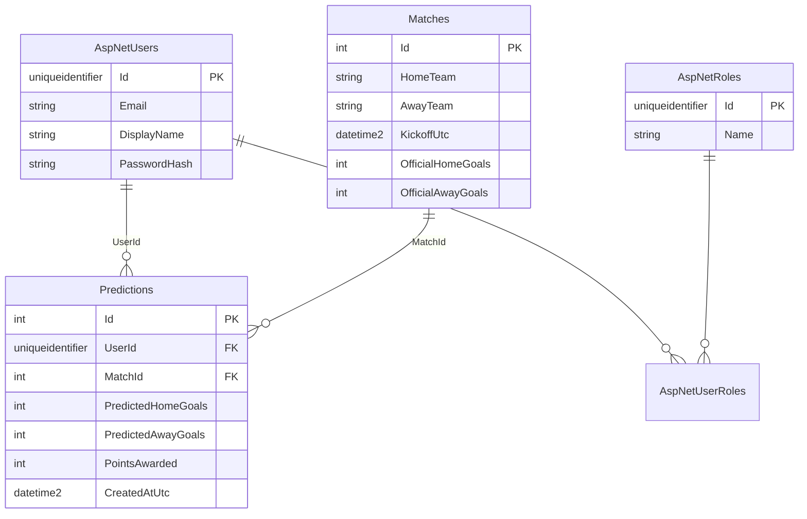

# Base de datos — Polla Mundialista

## Motor y conexión local

| Parámetro | Valor |
|-----------|-------|
| Motor | SQL Server (LocalDB en desarrollo) |
| Instancia | `(localdb)\mssqllocaldb` |
| Base de datos | `PollaMundialista` |
| ORM | EF Core 8 (Code-First + migraciones) |

Cadena en `backend/src/Polla.Api/appsettings.json` (desde la raíz del repo):

```
Server=(localdb)\mssqllocaldb;Database=PollaMundialista;Trusted_Connection=True;MultipleActiveResultSets=true
```

---

## Diagrama de tablas (negocio + Identity)



---

## Tablas de negocio

### `Matches` (12 filas seed)

| Columna | Tipo | Descripción |
|---------|------|-------------|
| `Id` | int PK | Identificador del partido |
| `HomeTeam` | nvarchar(100) | Equipo local |
| `AwayTeam` | nvarchar(100) | Equipo visitante |
| `KickoffUtc` | datetime2 | Inicio del partido (UTC) |
| `OfficialHomeGoals` | int NULL | Goles oficiales local (null = sin resultado) |
| `OfficialAwayGoals` | int NULL | Goles oficiales visitante |

**Constraints:**
- `CK_Matches_OfficialGoals_Pair` — ambos null o ambos con valor
- `CK_Matches_OfficialGoals_NonNegative` — goles ≥ 0

### `Predictions`

| Columna | Tipo | Descripción |
|---------|------|-------------|
| `Id` | int PK | Identificador predicción |
| `UserId` | uniqueidentifier FK → `AspNetUsers` | Quién predijo |
| `MatchId` | int FK → `Matches` | Partido |
| `PredictedHomeGoals` | int | Goles predichos local |
| `PredictedAwayGoals` | int | Goles predichos visitante |
| `PointsAwarded` | int (default 0) | Puntos 0–3 tras resultado oficial |
| `CreatedAtUtc` | datetime2 | Fecha de registro |
| `UpdatedAtUtc` | datetime2 NULL | Última edición |

**Constraints:**
- `UQ_Predictions_UserId_MatchId` — **una predicción por usuario y partido**
- `CK_Predictions_Goals_NonNegative` — goles ≥ 0
- FK con `ON DELETE NO ACTION` (Restrict)

---

## Tablas Identity (ASP.NET Core)

Gestionan autenticación; no están en Domain.

| Tabla | Uso |
|-------|-----|
| `AspNetUsers` | Usuarios (`ApplicationUser` + `DisplayName`) |
| `AspNetRoles` | Roles `User`, `Admin` |
| `AspNetUserRoles` | Asignación usuario ↔ rol |
| `AspNetUserClaims` | Claims adicionales |
| `AspNetUserLogins` | Logins externos |
| `AspNetUserTokens` | Tokens de reset, etc. |
| `AspNetRoleClaims` | Claims por rol |

---

## Datos iniciales (seed)

Al arrancar la API (`Program.cs` → `InitializeAsync`):

| Tipo | Detalle |
|------|---------|
| Roles | `User`, `Admin` |
| Admin | `admin@polla.demo` / `Admin123!` |
| Usuario demo | `user@polla.demo` / `User123!` |
| Partidos | 12 encuentros (10–21 jun 2026 UTC) |

El seed es **idempotente**: no duplica roles, usuarios ni partidos en reinicios.

---

## Flujo de datos en operaciones clave

### Predicción
```
Usuario → Predictions (UserId + MatchId único)
```

### Resultado oficial (Admin)
```
Admin → Matches.OfficialHomeGoals/AwayGoals
     → Predictions.PointsAwarded recalculado (regla 3-1-0)
```

### Leaderboard
```sql
Predictions JOIN AspNetUsers
GROUP BY UserId, DisplayName
→ SUM(PointsAwarded), COUNT(PointsAwarded = 3)
```

---

## Índices relevantes

| Índice | Tabla | Propósito |
|--------|-------|-----------|
| `IX_Matches_KickoffUtc` | Matches | Listar por fecha |
| `IX_Predictions_UserId` | Predictions | Historial usuario |
| `IX_Predictions_MatchId` | Predictions | Recálculo por partido |
| `IX_Predictions_UserId_MatchId` (UNIQUE) | Predictions | RN-01 unicidad |
